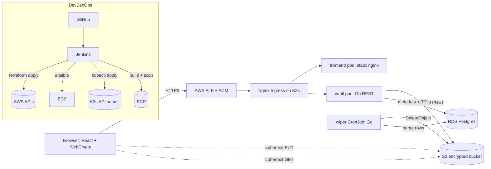

# Tethys Architecture

This document covers:

1. System overview and data flows
2. Threat model (STRIDE-lite)
3. Mapping of Tethys controls to NIST SP 800-207 Zero Trust Architecture

## 1. System overview

### Upload flow

1. User picks a file in the React UI and types a passphrase.
2. The browser derives a 256-bit AES-GCM key via `PBKDF2(SHA-256, 300k)`,
   generates a fresh 16-byte salt and 12-byte IV, and encrypts the file.
3. A JSON metadata header (filename, mime type) is prepended before the
   ciphertext so the download side can restore the download's filename.
4. Browser calls `POST /api/v1/uploads` with `{size, ttl, max_downloads}`.
   Vault persists a row in Postgres and returns a presigned S3 PUT URL and
   a 256-bit share token.
5. Browser PUTs ciphertext directly to S3.
6. Browser composes the share URL `https://<host>/d/<token>#<salt>.<iv>`
   and shows it to the user. The fragment after `#` never leaves the
   browser, so the salt/IV are invisible to the server and any proxy.

### Download flow

1. Recipient opens `https://<host>/d/<token>#<salt>.<iv>`.
2. Browser calls `GET /api/v1/downloads/{token}`. Vault opens a serializable
   transaction, atomically decrements `remaining_downloads`, and returns a
   short-lived presigned GET URL (or 410 Gone).
3. Browser downloads ciphertext from S3.
4. Recipient types the passphrase; browser derives the key, decrypts with
   `AES-GCM(iv)`, and triggers a browser download using the restored
   filename/mime.

### Wipe flow

1. Kubernetes CronJob `wiper` runs every 5 minutes.
2. Wiper opens a serializable txn, `SELECT ... FOR UPDATE SKIP LOCKED`s a
   batch of rows where `expires_at <= now()` or `remaining_downloads <= 0`,
   issues `S3:DeleteObject`, and deletes the rows.
3. The S3 bucket also has a hard 7-day lifecycle rule as a belt-and-suspenders
   backstop in case the wiper is ever unavailable.

## 2. Threat model (STRIDE-lite)

| Threat               | Example                                        | Mitigation |
| -------------------- | ---------------------------------------------- | ---------- |
| **Spoofing**         | Attacker impersonates Vault to the frontend    | TLS at ALB, Ingress, and S3 endpoint. NetworkPolicies ensure the frontend pod can only be reached from the ingress controller namespace. |
| **Tampering**        | Attacker mutates ciphertext in transit or S3   | AES-GCM is an AEAD; any tamper makes decryption fail on the recipient. S3 versioning + lifecycle expiry of noncurrent versions. |
| **Repudiation**      | User denies they uploaded a file               | `access_log` table in Postgres records `upload_init` / `download` with IP + UA. K8s audit logs enabled on the API server. |
| **Info disclosure**  | Server compromise reveals plaintext            | Plaintext never leaves the browser. Vault sees only metadata + ciphertext lengths. Presigned URLs expire in ~5 min. |
| **Denial of service**| Attacker exhausts S3 / RDS                     | ALB rate limits (can be tightened), per-upload size cap (100 MB demo), file count per IP could be added via Postgres. Free-tier bounded by design. |
| **Privilege escal.** | Vault pod tries to call `s3:DeleteObject`      | IAM policies are role-per-workload (`vault-role` has only PUT/GET, `wiper-role` has only DELETE/LIST). NetworkPolicies block pod-to-pod lateral movement. |

### Key non-goals / known gaps

- No SSO for upload. Demo uses a shared HS256 JWT secret. A real deployment
  should plug in OIDC (Cognito, Okta, Azure AD) via Istio or an auth proxy.
- No end-to-end integrity check of the passphrase: an incorrect passphrase
  fails *decryption* but the server cannot distinguish "wrong passphrase"
  from "tampered ciphertext" by design (GCM).
- Wiper latency is up to 5 minutes after TTL expiry. S3 lifecycle is the
  long-pole backstop (daily evaluation).
- On K3s, IAM-for-pods is approximated via the node instance profile.
  Production should switch to EKS Pod Identity or the
  [kube-workload-identity](https://github.com/kube-sa/aws-workload-identity)
  project.

## 3. NIST SP 800-207 mapping

NIST's seven tenets of Zero Trust map to concrete Tethys controls below.

| # | Tenet                                                                     | Tethys implementation |
| - | -------------------------------------------------------------------------- | --------------------- |
| 1 | All data sources and computing services are resources                     | Files (S3 objects), metadata (RDS rows), workloads (K8s pods), and infra (EC2 instances) are all first-class resources with ownership + tags + IAM. |
| 2 | All communication is secured regardless of network location                | TLS on the ALB (ACM), TLS from browser to S3, TLS from Vault/Wiper to RDS (enforced via `sslmode=require`), Kubernetes API server TLS, Kubelet TLS. |
| 3 | Access to individual enterprise resources is granted per-session          | Every upload gets its own random share token. Every download atomically decrements a counter and gets a *new* presigned GET URL valid for ~2 min. JWTs on the upload endpoint are short-lived. |
| 4 | Access is determined by dynamic policy                                    | TTL + remaining-download counters evaluated per-request. NetworkPolicies match on pod labels. IAM policies scoped per-workload (`vault` vs `wiper`). |
| 5 | The enterprise monitors and measures the integrity and security posture    | `access_log` table + K8s audit log + ALB access logs + Trivy image scan results + Semgrep SAST reports archived by Jenkins. |
| 6 | All resource authentication and authorization are dynamic and strictly enforced before access | HS256 JWT on `/uploads`; 256-bit share tokens on `/downloads`; IAM evaluation on every S3 call; NetworkPolicies enforce ingress/egress per-pod. |
| 7 | The enterprise collects as much information as possible about the current state and uses it to improve its security posture | RDS audit table, K8s audit log, zerolog structured logs from vault/wiper, SAST + image-scan results, Terraform state as the source of truth for what "should" exist. |

### Pillar coverage (CISA Zero Trust Maturity Model)

| Pillar           | Control (Traditional -> Advanced)                                        |
| ---------------- | ------------------------------------------------------------------------ |
| **Identity**     | Deployer IAM user with MFA; JWT + share token for users; per-workload IAM roles. |
| **Devices**      | Not directly enforced (it's a file-drop for humans), but PSA `restricted` profile prevents privileged pods. |
| **Networks**     | VPC with public/private split, SG per workload, K8s NetworkPolicies default-deny, TLS end-to-end. |
| **Applications** | Distroless containers, non-root, read-only root FS, seccomp `RuntimeDefault`, drop-ALL caps. |
| **Data**         | AES-256-GCM client-side, SSE on S3, encrypted RDS storage, TTL + wipe backstop. |

## Appendix A: image inventory

| Image                | Base                                  | Runs as      |
| -------------------- | ------------------------------------- | ------------ |
| `tethys/vault`       | `gcr.io/distroless/static-debian12:nonroot` | uid 65532    |
| `tethys/wiper`       | `gcr.io/distroless/static-debian12:nonroot` | uid 65532    |
| `tethys/frontend`    | `nginxinc/nginx-unprivileged:1.27-alpine`   | uid 101      |

All images are built by Jenkins from pinned base tags, scanned with Trivy,
pushed to a private ECR with `image_tag_mutability = IMMUTABLE`, and the
deployment manifests reference a git-sha tag (never `:latest` in production).

## Appendix B: AWS resource inventory

See `infra/terraform/outputs.tf` for the exact resources. Summary:

- VPC + 2 public + 2 private subnets (2 AZs)
- 3-5 EC2 `t3.micro` (Jenkins + K3s server + 1-3 agents)
- RDS `db.t3.micro` Postgres 16
- S3 bucket: SSE-S3, block-public, versioning, lifecycle 7-day expiry
- ALB: internet-facing, WAF optional (not enabled by default)
- 3 IAM roles: `vault`, `wiper`, `jenkins` + one `k3s_agent` instance profile
- 3 ECR repositories: immutable tags, scan-on-push
